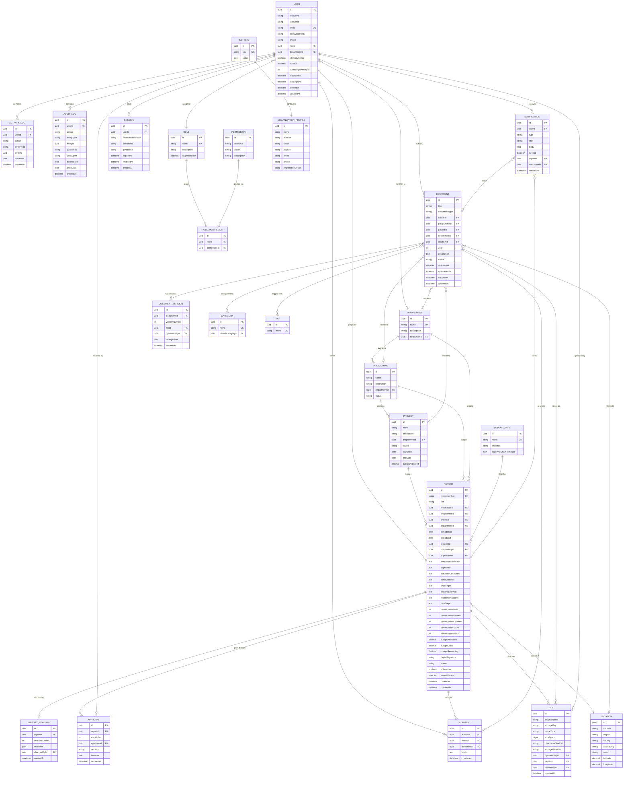

# Database ER Diagram
## SCA Report & Document Management System

**Version:** 1.0 (Phase 1 — Draft for Approval)
**Date:** August 7, 2026
**ORM:** Prisma · **Database:** PostgreSQL 15+

This document defines the logical data model. Physical Prisma schema (`schema.prisma`) with exact field types, indexes, and migrations will be produced in Phase 2 once this model is approved.

---

## 1. Entity-Relationship Diagram

---

## 2. Entity Notes

| Entity | Purpose |
|---|---|
| **User / Role / Permission / RolePermission** | Core RBAC. `RolePermission` is a join table enabling many-to-many role↔permission mapping; users may additionally receive scoped overrides (e.g., a Programme Manager scoped to one Programme) via a `UserScope` extension added in Phase 2 if needed. |
| **Department / Programme / Project** | Organizational hierarchy: Department → Programme → Project. Reports and Documents can be tagged at any level. |
| **Location** | Shared, reusable location record (country/region/county/sub-county/ward + optional GPS) referenced by both Reports and Documents to avoid duplicated free-text location data. |
| **ReportType** | Defines cadence (daily/weekly/monthly/quarterly/annual/ad-hoc) and a template for the approval chain, so workflow is configurable without code changes. |
| **Report** | Central record for all report content described in the SRS. `isSensitive` flags child-identifying content for restricted access. `searchVector` backs full-text search. |
| **ReportRevision** | Immutable snapshot on every submit/resubmit — powers revision history and diff view. |
| **Approval** | One row per step in a report's approval chain; supports multi-step workflows. |
| **Comment** | Polymorphic-by-nullable-FK: attaches to either a Report or a Document. |
| **Document / DocumentVersion / File** | `Document` is the logical record (metadata, categorization); `DocumentVersion` tracks version history; `File` is the physical artifact (one File per version, also reusable for Report attachments). |
| **Category / Tag** | Many-to-many classification independent of the Department/Programme/Project hierarchy, for cross-cutting taxonomy (e.g., "Training Manual", "Success Story"). |
| **Notification** | In-app + email notification log, optionally linked to the Report or Document that triggered it. |
| **ActivityLog / AuditLog** | Separated intentionally: `ActivityLog` is lightweight "recent activity" for UI feeds; `AuditLog` is the compliance-grade, immutable security record capturing before/after state, IP, and user agent. |
| **Session** | Tracks refresh tokens per device for revocation and "active sessions" management. |
| **Setting / OrganizationProfile** | Key-value system settings plus a dedicated organization profile record for branding and legal details. |

---

## 3. Indexing Strategy (Preview)

- `Report.reportNumber`, `Document` search fields: unique/GIN indexes.
- `Report.searchVector`, `Document.searchVector`: GIN indexes for full-text search.
- Composite indexes on (`programmeId`, `projectId`, `departmentId`, `status`, `createdAt`) for both Report and Document to accelerate the dashboard and filter queries.
- `AuditLog(entityType, entityId, createdAt)` for fast per-record history lookups.

Full index and constraint definitions will ship with the Phase 2 Prisma schema.

---

*End of Database ER Diagram — Phase 1 deliverable.*
