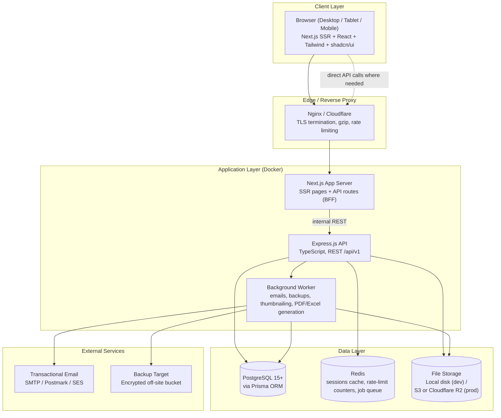
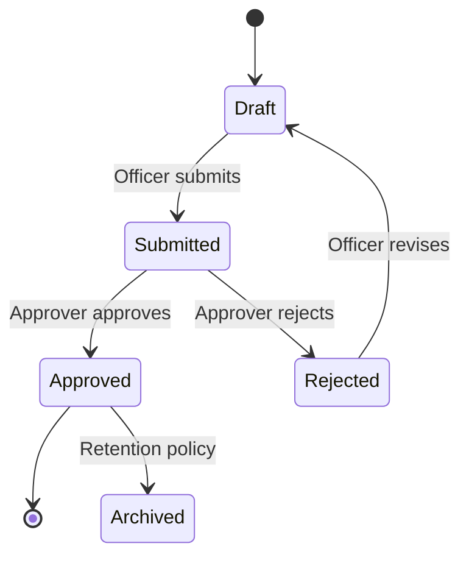
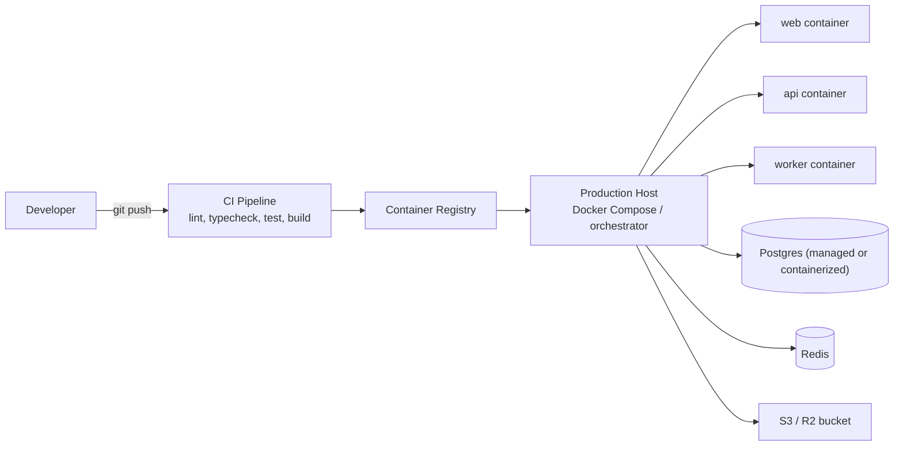

# System Architecture
## SCA Report & Document Management System

**Version:** 1.0 (Phase 1 — Draft for Approval)
**Date:** August 7, 2026

---

## 1. Architecture Overview

The system is a modular monolith split into two deployable services (web frontend, API backend) plus managed infrastructure (database, object storage, email). This keeps operational complexity low — appropriate for an NGO's IT capacity — while the codebase itself is feature-organized so pieces can be extracted into microservices later if SCA's scale demands it.



---

## 2. Component Breakdown

### 2.1 Frontend — Next.js Application
- **Framework:** Next.js (App Router) + React + TypeScript.
- **Styling:** Tailwind CSS + shadcn/ui component primitives; Framer Motion for micro-interactions (page transitions, card hover, modal enter/exit).
- **State/data:** TanStack Query for server-state (caching, refetching, optimistic updates); React Context for lightweight client state (theme, sidebar collapse, active org context).
- **Forms:** React Hook Form + Zod resolvers shared with backend validation schemas (single source of truth for validation rules where feasible).
- **Rendering strategy:** Server-side rendering for dashboards/reports needing fresh data and SEO-irrelevant but auth-gated pages; client components for interactive tables, charts (Recharts), and forms.
- **Responsibility:** Presentation, client-side validation, optimistic UI, calling the API layer. Contains no direct database access.

### 2.2 Backend — Express.js API
- **Framework:** Express.js + TypeScript, organized by feature (see Folder Structure doc).
- **Layers per feature:**
  - **Route layer** — HTTP routing, request/response shaping.
  - **Controller layer** — orchestrates request handling, calls services.
  - **Service layer** — business logic (approval workflows, report numbering, notification triggers).
  - **Repository layer** — Prisma queries isolated behind repository interfaces (enables mocking in tests and future DB changes).
  - **Validation layer** — Zod schemas per endpoint, shared types exported to frontend via a shared package.
  - **Middleware** — authentication (JWT verify), RBAC permission checks, rate limiting, request logging, error handling, audit-log capture.
- **API style:** REST, versioned under `/api/v1`, JSON:API-inspired response envelope (`data`, `meta`, `errors`). OpenAPI spec generated from route definitions (Phase 4).

### 2.3 Background Worker
- Separate Node process (same codebase, different entrypoint) handling: scheduled reminder emails (weekly/monthly/quarterly/annual), scheduled backups, PDF/Excel/Word/CSV generation for large exports, image/video thumbnail generation, and audit-log archival.
- Job queue backed by Redis (BullMQ) to keep the API responsive under load.

### 2.4 Database — PostgreSQL + Prisma
- Single PostgreSQL database, normalized schema (see ER Diagram doc).
- Prisma as the single ORM/migration tool; migrations version-controlled.
- Full-text search via PostgreSQL `tsvector`/`GIN` indexes on report and document searchable fields (title, summary, tags, keywords) — avoids introducing a separate search engine for v1; Elasticsearch/OpenSearch can be added later behind the same search-service interface if volume demands it.

### 2.5 File Storage Abstraction
- A `StorageAdapter` interface (`upload`, `getSignedUrl`, `delete`, `listVersions`) with two implementations:
  - `LocalDiskAdapter` for development (`/uploads` volume).
  - `S3CompatibleAdapter` for production (works against both AWS S3 and Cloudflare R2 since R2 is S3-API-compatible).
- All file metadata (owner, category, version, checksum) lives in PostgreSQL; only bytes live in the storage backend. This makes provider migration a config change, not a rewrite.

### 2.6 Authentication & Authorization
- **AuthN:** Email/password with bcrypt/argon2 hashing → JWT access token (short-lived) + refresh token (rotated, httpOnly cookie) → session table in PostgreSQL tracks active refresh tokens per device for revocation.
- **AuthZ:** RBAC engine: `Role → Permissions[]`, `User → Role (+ optional scoped overrides, e.g., programme-scoped Programme Manager)`. Middleware checks `resource:action` permission strings (e.g., `report:approve`, `document:delete`) before controllers execute.

### 2.7 Notifications
- Email via a provider-agnostic mailer service (SMTP/Postmark/SES interchangeable via config), templated with a shared layout (SCA branding).
- In-app notifications stored in PostgreSQL, delivered to the frontend via polling (TanStack Query interval) for v1; WebSocket/SSE push can be added later without changing the data model.

### 2.8 Observability & Logging
- Structured logging (pino/winston) with request IDs correlating frontend errors to backend logs.
- Audit log is a distinct, append-only table separate from application logs — it is a compliance record, not a debugging tool.

---

## 3. Key Flows

### 3.1 Authentication Flow
```mermaid
sequenceDiagram
    participant U as User (Browser)
    participant W as Next.js
    participant A as Express API
    participant DB as PostgreSQL

    U->>W: Submit login form
    W->>A: POST /api/v1/auth/login
    A->>DB: Verify user + password hash
    DB-->>A: User record + role
    A->>A: Issue JWT (15m) + refresh token (rotated)
    A-->>W: access token (body) + refresh token (httpOnly cookie)
    W-->>U: Redirect to role-aware dashboard
    Note over U,A: Subsequent requests send Bearer access token;<br/>silent refresh via /auth/refresh when expired
```

### 3.2 Report Approval Workflow


### 3.3 File Upload & Validation
1. Client requests a pre-signed upload target (or streams to API in dev mode).
2. API validates file extension allow-list + MIME sniffing (magic bytes) + configurable max size before accepting.
3. File is stored via `StorageAdapter`; a `File` record (checksum, size, mime, owner, version) is created in PostgreSQL.
4. Worker generates thumbnail/preview asynchronously for images, video posters, and Office/PDF previews.
5. Every upload, download, and view is written to the Audit Log.

---

## 4. Deployment Architecture



- **Development:** Docker Compose spins up web, api, worker, Postgres, Redis, and a local S3-compatible emulator (MinIO) so local storage behavior matches production.
- **Production:** Same containers deployed behind Nginx/Cloudflare; Postgres and Redis can be managed services or containerized depending on SCA's hosting budget; object storage moves to Cloudflare R2 or AWS S3.
- **CI/CD:** Lint → typecheck → unit/integration tests → build images → push to registry → deploy. Full detail in the Deployment Guide (later phase).

---

## 5. Scalability & Reliability Notes

- Stateless API (JWT-based) allows horizontal scaling behind a load balancer with no sticky sessions.
- Redis-backed job queue decouples slow operations (large exports, email blasts) from request/response latency.
- Database indexing strategy (see ER Diagram doc) targets the heaviest query patterns: report search/filter, document search/filter, dashboard aggregate counts.
- Backups (daily/weekly/monthly) run from the worker against both the database (`pg_dump`) and object storage (versioned bucket or periodic sync to a secondary location).

---

*End of System Architecture — Phase 1 deliverable.*
