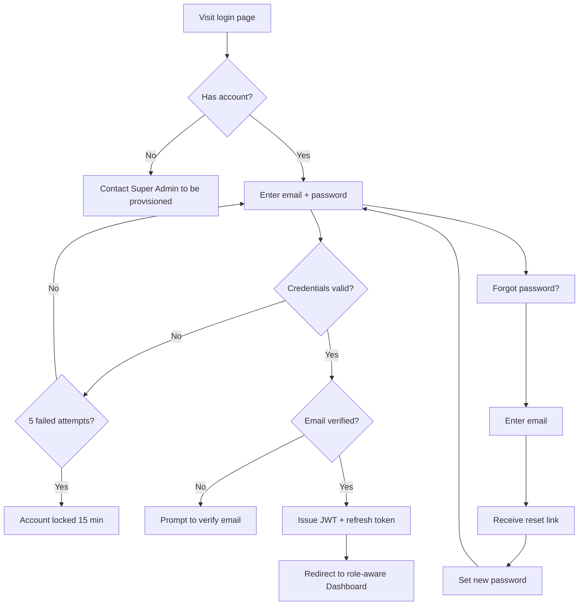
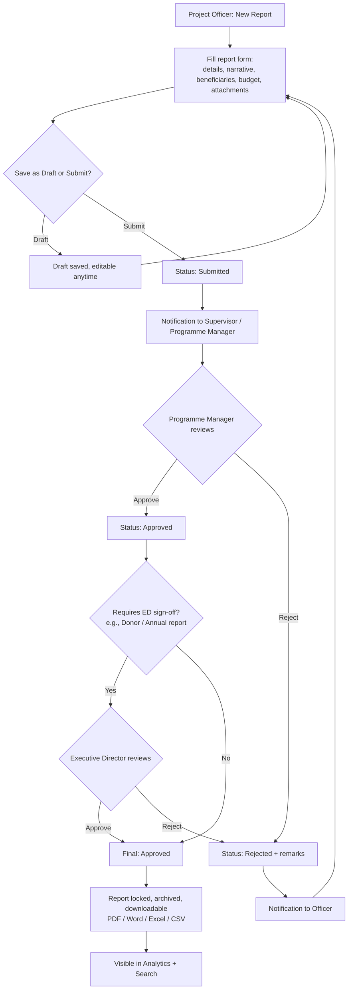
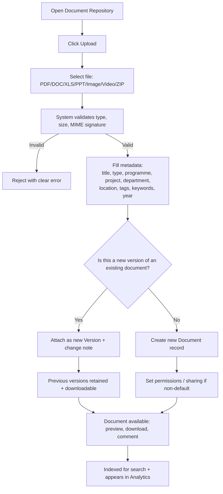
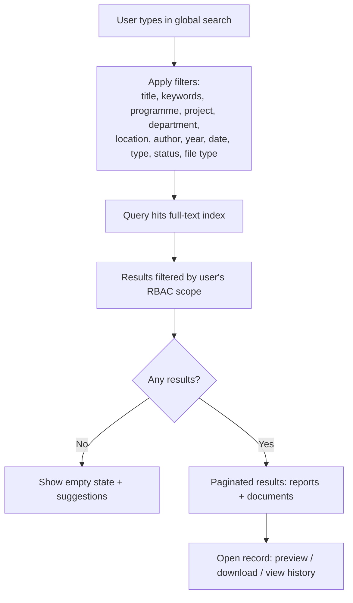
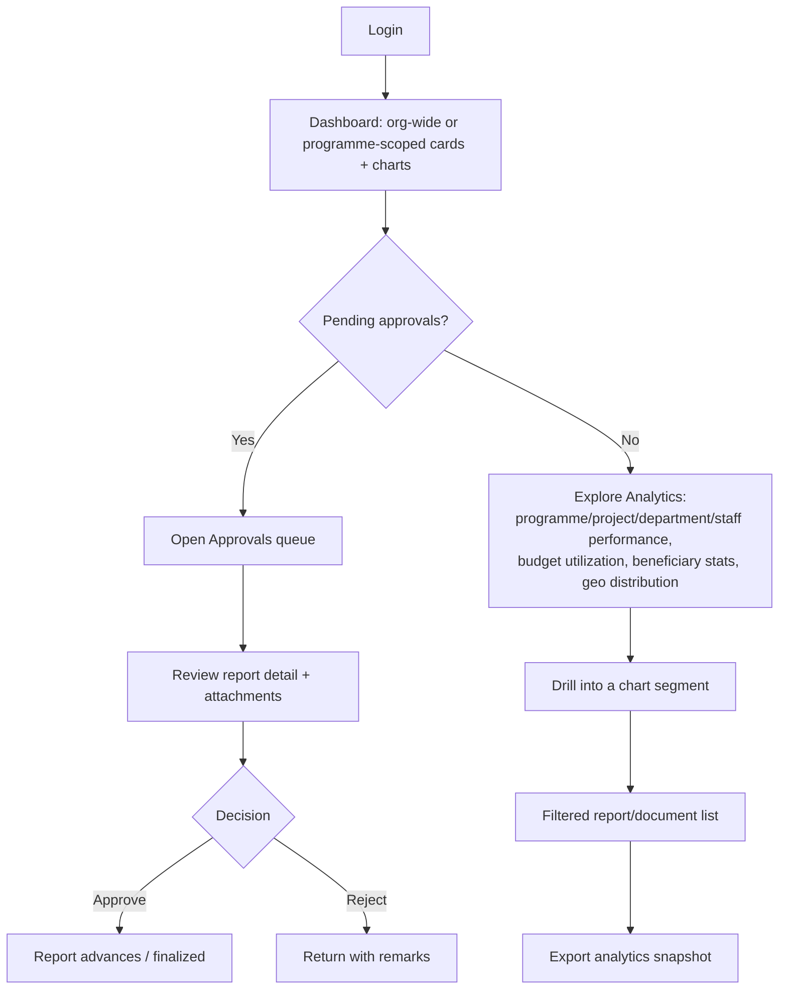
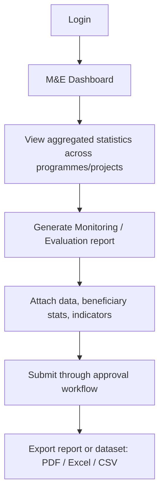
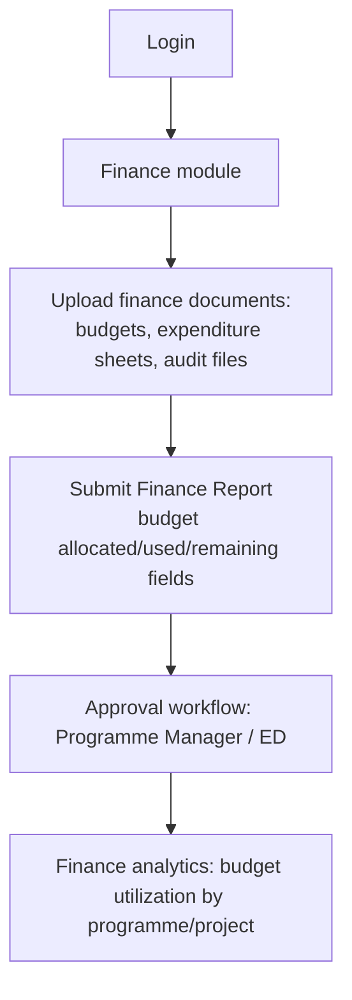
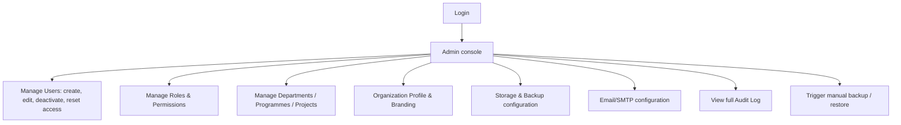

# User Flow
## SCA Report & Document Management System

**Version:** 1.0 (Phase 1 — Draft for Approval)
**Date:** August 7, 2026

---

## 1. Authentication Flow (All Roles)

---

## 2. Report Lifecycle Flow (Project Officer → Programme Manager → Executive Director)

---

## 3. Document Upload & Versioning Flow (Any Uploading Role)

---

## 4. Advanced Search Flow (Any Role, Permission-Filtered)

---

## 5. Executive Director / Programme Manager — Analytics & Approvals Flow

---

## 6. Monitoring & Evaluation Officer Flow

---

## 7. Finance Officer Flow

---

## 8. Super Administrator Flow

---

## 9. Notes

- All flows are permission-gated; a user attempting an action outside their role sees a clear "not authorized" state rather than a broken UI.
- Every terminal action in these flows (submit, approve, reject, upload, delete, export, download) writes an Audit Log entry per SRS FR-8.1.
- Rejected reports always return to **Draft**, never silently vanish — full history is retained per FR-2.4.

---

*End of User Flow — Phase 1 deliverable.*
